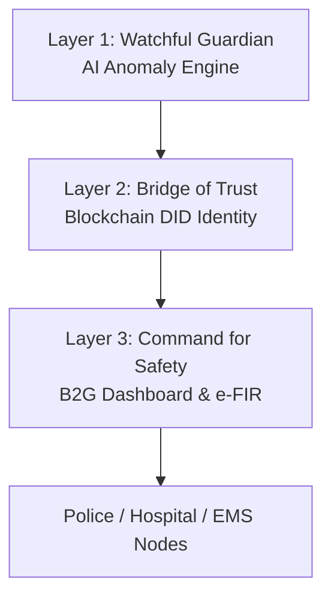

# TourSafe — MASTER CONTEXT

> **Single source of truth for every AI agent, developer, and stakeholder working on TourSafe.**
> Read this file before writing, editing, or reviewing any TourSafe code or document.

---

## 1. Project Identity

| Attribute | Value |
|-----------|-------|
| **Project Name** | TourSafe |
| **Tagline** | *No traveler should have to choose between exploring the world and staying safe.* |
| **Team** | TriArch — Vishal Lakshmikanthan, Sneha C, Madhu |
| **Institution** | Sri Sairam Engineering College, Chennai |
| **Document Date** | 2026-08-11 |
| **Context Version** | v2.0 |
| **Project Phase** | Pre-MVP → Sprint 1/4 |

### What TourSafe Is
TourSafe is an **AI-driven, proactive travel-safety ecosystem** that detects emergencies autonomously through mobile and IoT sensors, verifies traveler identity through blockchain-based Self-Sovereign Identity (DID), and dispatches standardized electronic First Information Reports (e-FIR) to the nearest police and hospital nodes within minutes.

### What TourSafe Is Not
- It is **not** just an SOS button.
- It is **not** a travel insurance product.
- It is **not** a social network or a travel booking platform.

---

## 2. Problem

### The Fatal Golden Hour Delay
- International travelers face a **20–30 minute administrative lag** before medical care begins.
- Remote-area EMS response times are up to **3× slower** than urban benchmarks.
- **70% of response latency** is caused by identity verification, manual reporting, and fragmented systems.

### Root Causes
1. **Predictive blindness** — no AI monitoring of traveler state.
2. **Identity crisis** — 6,000+ valid ID types, cross-border data restrictions, unconscious victims.
3. **Legacy fragmentation** — paper reports, phone dispatch, siloed databases.

### Target Impact
- Reduce **identification-to-dispatch** window from 20–30 min to **< 5 minutes**.
- Cover **5,000+ travelers** in initial Safe Zones within 12 months of launch.
- Align with UN SDG 8, SDG 11, and SDG 16.

---

## 3. Vision

> Transform travel safety from a reactive, human-triggered service into an **autonomous, silent guardian infrastructure** that works even when the traveler is unconscious, incapacitated, or out of network coverage.

### Core Design Principles
1. **Proactive** — detect emergencies through sensor AI, not user action.
2. **Identity-sovereign** — traveler controls encrypted identity and medical data; authorized responders decrypt only during confirmed emergencies.
3. **Resilient** — operate in zero-connectivity zones through offline-first buffering and auto-sync.

---

## 4. Scope

### In Scope (MVP)
- React Native mobile app (iOS + Android, bare CLI workflow).
- Background 50Hz IMU + 1Hz GPS telemetry ingestion.
- Sequence-to-Sequence LSTM Autoencoder anomaly detection.
- SQLite + AES-256 offline telemetry buffer.
- Client-side geo-fencing with Turf.js.
- Polygon PoS blockchain DID identity layer.
- W3C DID + IPFS encrypted medical vault.
- FastAPI real-time backend with WebSocket telemetry.
- Redis live GPS cache + MongoDB persistent archive.
- MERN B2G authority dashboard with Mapbox GL JS.
- Automated e-FIR generation and dispatch.
- Haversine-based nearest police/hospital routing.
- ESP32/RPi Pico W hardware prototype.

### Out of Scope (MVP)
- Satellite connectivity (Phase 2).
- Wearable companion apps (Phase 2).
- Bluetooth mesh peer relay (Phase 2).
- Computer vision verification (Phase 2).
- Multilingual NLP responder chat (Phase 2).
- Insurance API integration (Phase 3).
- Cross-border protocol standardization (Phase 3).

---

## 5. Users

| User | Role |
|------|------|
| **Traveler** | Registers identity, carries device, is protected silently in background. |
| **First Responder / Authority** | Scans QR, receives e-FIR, coordinates response via B2G dashboard. |
| **Tourism Department / Safe Zone Operator** | Licenses zone, monitors heatmaps, manages geo-fences. |
| **Hospital / Police Node** | Receives structured e-FIR payloads and dispatch notifications. |
| **System Administrator** | Manages deployments, threshold tuning, compliance, access logs. |

---

## 6. Complete Feature Inventory

### Status Legend
- ✅ **Implemented** — code exists and has been validated.
- 🚧 **In Development** — active work in progress.
- 📋 **Planned** — scheduled for current roadmap.
- 💡 **Conceptual** — future idea, not yet scheduled.

### Feature Matrix

| # | Feature | Owner | Status |
|---|---------|-------|--------|
| 1 | React Native bare-CLI project scaffold | Member 2 | 📋 |
| 2 | 50Hz IMU accelerometer background service | Member 2 | 📋 |
| 3 | 1Hz background GPS polling | Member 2 | 📋 |
| 4 | A_mag magnitude pre-processing | Member 2 | 📋 |
| 5 | Sliding-window (150 pt, 50% overlap) segmentation | Member 2 | 📋 |
| 6 | SQLite offline telemetry queue | Member 2 | 📋 |
| 7 | AES-256-CBC offline payload encryption | Member 2 | 📋 |
| 8 | Autocommit flush on reconnect | Member 2 | 📋 |
| 9 | Turf.js client-side geo-fence evaluation | Member 2 | 📋 |
| 10 | Manual SOS override | Member 2 | 📋 |
| 11 | FastAPI WebSocket telemetry handler | Member 1 | 📋 |
| 12 | Redis live GPS cache (5-min TTL) | Member 1 | 📋 |
| 13 | MongoDB traveler/incident/e-FIR persistence | Member 1 | 📋 |
| 14 | Socket.io incident push to dashboard | Member 1 | 📋 |
| 15 | LSTM Autoencoder model (TF/Keras) | Member 2 | 📋 |
| 16 | ONNX Runtime production inference | Member 2 | 📋 |
| 17 | 99.5th percentile anomaly threshold | Member 2 | 📋 |
| 18 | Two-stage anomaly confirmation | Member 2 | 📋 |
| 19 | SNN-CAD trajectory hazard detection | Member 2 | 💡 |
| 20 | Haversine dispatch router | Member 1 | 📋 |
| 21 | Solidity Identity Resolution Contract | Member 2 | 📋 |
| 22 | secp256k1 key generation + SecureStore | Member 2 | 📋 |
| 23 | IPFS encrypted medical vault (Pinata/Web3.Storage) | Member 2 | 📋 |
| 24 | Dynamic QR code for responder access | Member 2 | 📋 |
| 25 | Emergency Cryptographic Access Key grant | Member 2 | 📋 |
| 26 | MERN dashboard scaffold | Member 1 | 📋 |
| 27 | Mapbox GL JS live map + heatmap | Member 1 | 📋 |
| 28 | e-FIR JSON + PDF generation | Member 1 | 📋 |
| 29 | e-FIR dispatch to police/hospital APIs | Member 1 | 📋 |
| 30 | Hardware prototype (ESP32 + MPU6050 + NEO-6M) | Member 1 / 3 | 📋 |
| 31 | Unit, integration, load, hardware tests | Member 3 | 📋 |
| 32 | Docker + Docker Compose dev environment | Member 1 | 📋 |
| 33 | CI/CD GitHub Actions pipeline | Member 1 | 📋 |
| 34 | Documentation suite (this repo) | Member 3 | 🚧 |
| 35 | Demo scenarios + mock datasets | Member 3 | 📋 |

---

## 7. Architecture

### Three-Layer Shield



### High-Level Data Flow
1. Mobile app polls IMU at 50Hz and GPS at 1Hz.
2. Raw IMU is converted to orientation-invariant `A_mag = sqrt(Ax² + Ay² + Az²)`.
3. 150-point windows (3 s) are produced every 1.5 s (50% overlap).
4. Telemetry reaches FastAPI via WebSocket if online, or SQLite buffer if offline.
5. ONNX Runtime LSTM Autoencoder evaluates reconstruction error.
6. Confirmed anomaly triggers:
   - Socket.io push to MERN dashboard.
   - Smart-contract emergency access grant.
   - e-FIR compilation + Haversine routing.
   - Dispatch to nearest police/hospital nodes.
7. Responder scans traveler's QR → DID resolves → IPFS vault decrypted → medical data displayed.

---

## 8. Technology Decisions

| Layer | Technology | Why |
|-------|------------|-----|
| Mobile | React Native CLI + TypeScript | Native hardware access; shared iOS/Android code; type safety for life-critical data. |
| Mobile State | Redux Toolkit + TanStack Query | Global safety state + server-state sync. |
| Sensors | Expo Sensors, Expo Location | 50Hz IMU + background GPS abstractions. |
| Maps | Google Maps API + Turf.js | Rendering + offline geo-fence math. |
| Offline Buffer | SQLite + AsyncStorage | Encrypted queue + lightweight session state. |
| Crypto (mobile) | ethers.js + Expo SecureStore | secp256k1 keypair + hardware-backed storage. |
| Backend Core | FastAPI (Python, ASGI) | Async WebSockets + ML ecosystem proximity. |
| Cache | Redis | Sub-ms live GPS reads for dashboard. |
| Database | MongoDB | Flexible schema for incidents, profiles, e-FIRs. |
| Realtime | WebSocket (client↔FastAPI) + Socket.io (backend↔dashboard) | Persistent low-latency channels. |
| ML Training | TensorFlow/Keras | Sequence-to-Sequence LSTM Autoencoder. |
| ML Inference | ONNX Runtime | Fast single-sample prediction. |
| Blockchain | Polygon PoS (Amoy → Mainnet) | Sub-cent gas, sub-second finality, EVM-compatible. |
| Smart Contracts | Solidity + Hardhat | DID registration, resolution, emergency access. |
| Storage (vault) | IPFS (Pinata/Web3.Storage) | Decentralized encrypted medical data. |
| Dashboard | MERN + Mapbox GL JS | Real-time operational interface. |
| DevOps | Docker + Docker Compose + GitHub Actions | Reproducible environments, CI/CD. |
| Hardware MVP | ESP32 / RPi Pico W + MPU6050 + NEO-6M | Tangible validation without full mobile simulation. |

---

## 9. Data Flow Details

### Normal Telemetry Flow
```
Device Sensors → A_mag → Sliding Window → WebSocket → FastAPI → ONNX Inference
   ↓                                                                              
SQLite Buffer (if offline) ← Redis GPS Cache ← MongoDB Archive ← Normal Logging
```

### Emergency Flow
```
LSTM/SNN-CAD Anomaly Confirmed
   ↓
Socket.io Incident Packet → MERN Dashboard
   ↓
Smart Contract grantEmergencyAccess(DID)
   ↓
e-FIR Microservice: anomaly log + DID vault + GPS + Haversine targets
   ↓
JSON + PDF e-FIR dispatched to Police API + Hospital API
   ↓
Responder scans QR → resolveDID → decrypt vault → display medical data
```

---

## 10. AI Logic

### LSTM Autoencoder
- **Input**: 150-timestep `A_mag` magnitude vector (3-second window, 50% overlap).
- **Architecture**: Encoder LSTM layers → latent vector → RepeatVector → Decoder LSTM layers.
- **Loss**: Mean Squared Error (MSE) reconstruction error.
- **Training**: Only on normal activity (walking, driving, sitting, light hiking).
- **Threshold**: 99.5th percentile of validation reconstruction errors.
- **Confirmation**: Two consecutive overlapping windows must exceed threshold.

### Twin Trigger Scenarios
1. **Crash / Physical Impact** — massive instantaneous G-force spike followed by chaotic motion or abrupt immobility.
2. **Immobility / Unconsciousness** — `A_mag` flatline at ~9.81 m/s² for multiple windows AND static GPS in remote zone.

### SNN-CAD (Conceptual)
- Computes Hausdorff distance between observed GPS trajectory and historical safe routes.
- AUC target ≈ 0.97 for hazardous deviation detection.

---

## 11. Blockchain / DID Logic

### W3C Decentralized Identifier
- Each traveler owns one DID.
- DID Document contains public key; DID hash and vault CID are anchored on Polygon PoS.
- Sensitive medical data is **never** on-chain; it lives in an encrypted IPFS vault.

### Identity Resolution Contract Functions
- `registerDID(account, publicKeyHash, ipfsCID)` — onboarding.
- `resolveDID(did)` — returns public key + vault CID.
- `grantEmergencyAccess(did, agency)` — emits time-limited access event.
- `revokeEmergencyAccess(did, agency)` — closes access window.

### Emergency QR Protocol
1. Mobile displays QR with DID + signed verification token.
2. Responder scans via authorized device.
3. Dashboard resolves DID on-chain.
4. Fetches encrypted vault from IPFS.
5. Decrypts with agency Emergency Cryptographic Access Key.
6. Displays blood type, allergies, conditions, contacts, insurance.

### Privacy Guarantees
- No raw medical data on-chain.
- Access grants are time-limited and logged immutably.
- Access is only possible after AI-confirmed emergency.

---

## 12. Mobile Architecture

### Key Modules
- `SensorService` — IMU 50Hz + GPS 1Hz listeners.
- `WindowProcessor` — ring buffer + A_mag + 150-pt sliding windows.
- `NetworkInterceptor` — ping, encrypt-on-fail, queue to SQLite.
- `AutocommitJob` — flush queue every 30 s when online.
- `GeoFenceEngine` — Turf.js boundary checks against cached GeoJSON.
- `DIDWallet` — ethers.js keypair + SecureStore + QR display.
- `SOSOverride` — manual emergency trigger.

### Navigation
- Onboarding (DID + medical + emergency contacts)
- Home (safety status, geo-fence alerts, connection state)
- Live Map (self-location + safe zones)
- Emergency Override (manual SOS)

---

## 13. Backend Architecture

### FastAPI Services
- `telemetry_router.py` — `/ws/telemetry/{traveler_id}` WebSocket handler.
- `inference_worker.py` — ONNX Runtime LSTM evaluation pool.
- `anomaly_event_emitter.py` — dispatches confirmed incidents.
- `geo_fence_service.py` — server-side boundary confirmation.

### Data Stores
- **Redis**: `traveler_id → {lat, lng, timestamp}` with 5-min TTL.
- **MongoDB**:
  - `travelers`
  - `telemetry_archive`
  - `incidents`
  - `efir_archive`
  - `geo_fences`
  - `agencies`

### MERN Dashboard Microservices
- `auth-service` — JWT agency login.
- `telemetry-service` — REST queries for live/historical data.
- `incident-service` — incident feed + timeline.
- `efir-service` — e-FIR JSON/PDF generation + dispatch.
- `socket-relay` — Socket.io push server.

---

## 14. Database Decisions

| Data | Store | Why |
|------|-------|-----|
| Live GPS | Redis | Sub-millisecond reads for map rendering. |
| Profiles / Incidents / e-FIRs | MongoDB | Schema flexibility + geographic replication. |
| Offline Queue | SQLite (device) | Local, encrypted, resilient. |
| DID anchors | Polygon PoS blockchain | Tamper-proof identity verification. |
| Encrypted vault | IPFS | Decentralized, censorship-resistant availability. |

---

## 15. Offline-First Architecture

- Network interceptor pings FastAPI before every WebSocket send.
- On timeout: serialize payload → AES-256-CBC encrypt → insert SQLite `TelemetryQueue` with `PENDING` status.
- Background job checks connectivity every 30 seconds.
- On reconnect: transmit pending rows in chronological order; mark `COMMITTED` on ACK.
- Target recovery rate: > 99.9%.

---

## 16. Security Assumptions

- Traveler's private key never leaves device secure enclave.
- Agency Emergency Cryptographic Access Keys are issued offline by TourSafe administrators.
- All backend services run over TLS 1.3 in production.
- MongoDB connections use TLS + role-based access control.
- Smart contracts audited before mainnet deployment.
- Telemetry purged 24 h after trip end; only anonymized incident aggregates retained.
- AES-256 keys are session-derived and rotated per trip.

---

## 17. Team Responsibilities

| Member | AI Access | Responsibility Weight | Domains |
|--------|-----------|----------------------|---------|
| **Member 1** | Claude credits | **40%** | System architecture, backend (FastAPI, Redis, MongoDB), DevOps (Docker, CI/CD), integration |
| **Member 2** | Claude credits | **40%** | Mobile app (React Native), AI/ML (LSTM, ONNX), blockchain/DID integration |
| **Member 3** | Free tier only | **20%** | UI support, testing, documentation, datasets, mock scenarios, hardware support |

### Work Allocation Guidance
- Member 1 and Member 2 own all technically complex, AI-heavy modules.
- Member 3 handles manual QA, dataset collection, documentation maintenance, demo scripting, and lightweight UI polish.
- Member 3 should never be the sole owner of architecture, security, ML, or smart-contract code.

---

## 18. Repository Structure

> Two documentation zones are maintained:
> - `docs/` (repository root) — new engineering implementation documentation.
> - `TriArch_IDL_TourSafe/docs/` — original academic/project/reference documentation.

```
TOURSAFE/
├── .github/
│   ├── ISSUE_TEMPLATE/
│   │   ├── bug_report.yml
│   │   ├── feature_request.yml
│   │   └── task.yml
│   ├── workflows/
│   │   ├── ci.yml
│   │   └── cd-staging.yml
│   └── pull_request_template.md
├── backend/                          # FastAPI + Python
├── blockchain/                       # Solidity + Hardhat
├── config/                           # Docker Compose + Nginx
├── dashboard/                        # MERN + Mapbox GL JS
├── docs/                             # Engineering implementation docs
├── hardware/                         # ESP32 / RPi Pico W firmware
├── ml/                               # LSTM training, ONNX export, datasets
├── mobile/                           # React Native + TypeScript
├── scripts/                          # Setup, seed, deployment helpers
├── tests/                            # Cross-module test suites
├── TriArch_IDL_TourSafe/
│   ├── docs/                         # Original project/reference docs
│   │   ├── 00_MASTER_CONTEXT.md      ← YOU ARE HERE
│   │   ├── 01_PRODUCT_REQUIREMENTS.md
│   │   ├── 02_SYSTEM_ARCHITECTURE.md
│   │   ├── 03_TECHNICAL_SPECIFICATION.md
│   │   ├── 04_MOBILE_APP_SPECIFICATION.md
│   │   ├── 05_BACKEND_SPECIFICATION.md
│   │   ├── 06_AI_ML_SPECIFICATION.md
│   │   ├── 07_BLOCKCHAIN_DID_SPECIFICATION.md
│   │   ├── 08_GEOFENCING_SPECIFICATION.md
│   │   ├── 09_EMERGENCY_RESPONSE_ENGINE.md
│   │   ├── 10_OFFLINE_FIRST_SPECIFICATION.md
│   │   ├── 11_DATABASE_SCHEMA.md
│   │   ├── 12_API_CONTRACT.md
│   │   ├── 13_WEBSOCKET_CONTRACT.md
│   │   ├── 14_SECURITY_PRIVACY.md
│   │   ├── 15_HARDWARE_INTEGRATION.md
│   │   ├── 16_TESTING_STRATEGY.md
│   │   ├── 17_DEMO_SCENARIOS.md
│   │   ├── 18_TEAM_TASK_ALLOCATION.md
│   │   ├── 19_IMPLEMENTATION_ROADMAP.md
│   │   ├── 20_EXECUTION_PLAYBOOK.md
│   │   ├── 21_GIT_WORKFLOW.md
│   │   ├── 22_AI_AGENT_INSTRUCTIONS.md
│   │   ├── 23_DEFINITION_OF_DONE.md
│   │   ├── 24_CHANGELOG.md
│   │   └── 25_CURRENT_STATE.md
│   ├── IMAGES_LOGO/
│   └── [PDFs, reports, presentations]
├── .env.example
├── .gitignore
└── README.md
```

---

## 19. Development Phases

### Phase 0 — Documentation & Scaffolding (Current)
- Finalize context documents.
- Create repository structure.
- Set up Docker Compose dev environment.
- Initialize mobile/backend/dashboard/blockchain skeletons.

### Phase 1 — Core Infrastructure (Sprint 1)
- Docker environment.
- FastAPI backbone + WebSocket scaffold.
- MERN dashboard scaffold + Mapbox canvas.
- React Native skeleton + permissions.

### Phase 2 — Client Telemetry & Offline Buffering (Sprint 2)
- 50Hz IMU + 1Hz GPS.
- SQLite + AES-256 offline queue.
- Turf.js geo-fencing.

### Phase 3 — ML Execution & Authority Communication (Sprint 3)
- LSTM training + ONNX export.
- Threshold calibration + two-stage confirmation.
- Socket.io real-time streaming.
- SNN-CAD integration (stretch).

### Phase 4 — Blockchain DID & e-FIR Automation (Sprint 4)
- Solidity contract on Polygon Amoy.
- Mobile DID onboarding + IPFS vault.
- QR code responder access.
- e-FIR JSON/PDF + dispatch.

### Phase 5 — Integration, Testing, Demo (Post-Sprint)
- End-to-end integration tests.
- Hardware prototype validation.
- Demo scenarios + pitch materials.

### Phase 6 — Future Enhancements (Post-MVP)
- Bluetooth mesh, satellite, wearables, CV, NLP, insurance APIs, global certification.

---

## 20. Current Implementation Status

- [ ] Mobile app scaffold
- [ ] FastAPI backend scaffold
- [ ] MERN dashboard scaffold
- [ ] Smart contract scaffold
- [ ] Docker Compose environment
- [ ] CI/CD pipeline
- [x] Documentation suite initiated
- [ ] LSTM dataset collected
- [ ] Hardware prototype assembled

> **Overall: 0% functional implementation; documentation and scaffolding in progress.**

---

## 21. Completed Work

- Existing project reports, pitch decks, and literature review compiled in `TriArch_IDL_TourSafe/`.
- Team formed and roles allocated.
- Core technology stack selected.
- Master context and documentation plan established.

---

## 22. Pending Work

1. Set up development environment per `20_EXECUTION_PLAYBOOK.md`.
2. Implement all modules listed in the feature inventory.
3. Collect/create normal-activity sensor datasets.
4. Deploy smart contracts to Polygon Amoy Testnet.
5. Build and validate hardware prototype.
6. Run integration, load, and hardware tests.
7. Execute demo scenarios.

---

## 23. Known Risks

| Risk | Likelihood / Impact | Mitigation |
|------|---------------------|------------|
| LSTM false positives | Medium / High | Two-stage confirmation; human dashboard confirmation; threshold recalibration. |
| Network loss in remote areas | High / Medium | SQLite offline buffer; Bluetooth mesh (Phase 2). |
| Polygon gas fee spikes | Low / Medium | Batch non-emergency transactions; prioritize emergency access gas. |
| IPFS vault unavailability | Low / High | Dual-pinning + encrypted backup in MongoDB gated by smart contract. |
| Smart contract vulnerability | Low / Critical | Third-party audit; formal verification; bug bounty. |
| Battery drain from 50Hz polling | Medium / High | Adaptive polling (50Hz active → 5Hz stationary); foreground/background management. |
| Regulatory non-compliance | Medium / High | Jurisdiction-aware data residency; DID encryption; legal review. |
| First responders lack QR capability | Medium / High | Training programs; spoken DID fallback; browser-based dashboard. |

---

## 24. Constraints

- **Time**: 4-sprint MVP, followed by integration/demo phase.
- **Budget**: AI credits concentrated on Member 1 and Member 2; Member 3 limited to free-tier tools.
- **Hardware**: Mobile IMU sampling may vary by device; target 50Hz but gracefully degrade.
- **Network**: Must function in intermittent/no-connectivity scenarios.
- **Privacy**: Medical data must never be stored or transmitted in plaintext.
- **Regulation**: Must respect GDPR, PDPA, HIPAA-like, and local data-localization laws.

---

## 25. Coding Conventions

### General
- Use English for all code, comments, and commit messages.
- Prefer explicit, descriptive names over abbreviations.
- Keep functions small and single-purpose.
- Write docstrings/comments for every public function.

### TypeScript / React Native
- Strict TypeScript enabled.
- Functional components + hooks.
- Redux Toolkit for global state; TanStack Query for server state.
- Async/await; no callback pyramids.

### Python / FastAPI
- Pydantic models for every request/response payload.
- `async def` for I/O-bound routes and WebSocket handlers.
- `black` + `isort` + `flake8` formatting.
- Type hints everywhere.

### Solidity
- Solidity ^0.8.20.
- OpenZeppelin contracts for access control where applicable.
- Explicit access modifiers and event emissions.
- Comprehensive Hardhat tests before any deployment.

### Git
- Branch naming: `feature/`, `bugfix/`, `hotfix/`, `docs/`.
- Commit messages in imperative mood: `Add`, `Fix`, `Update`, `Refactor`.
- Squash-merge feature branches into `main` via pull requests.

---

## 26. Testing Requirements

- **Unit tests** for every pure function (A_mag, Haversine, AES, windowing, contract functions).
- **Integration tests** for telemetry→inference→Socket.io flow and offline buffer flush.
- **Load tests** with Locust: 1,000 concurrent WebSocket streams; 99th percentile < 500 ms.
- **Hardware tests** for crash simulation, offline recovery, geo-fence breach.
- **Security tests** for DID access control, encryption round-trips, and TLS configuration.

See `16_TESTING_STRATEGY.md` for full details.

---

## 27. Git Rules

1. `main` is always deployable.
2. All changes go through pull requests.
3. PR requires at least one review from another member.
4. CI must pass before merge.
5. Rebase feature branches onto `main` before merging.
6. Tag releases as `v0.1.0`, `v0.2.0`, etc.
7. Never commit secrets, private keys, or `.env` files.

See `21_GIT_WORKFLOW.md` for full details.

---

## 28. AI-Agent Rules

When working on TourSafe, every AI agent (Claude, ChatGPT, Gemini, Copilot) must:

1. **Read this file first** before any code change.
2. **Honor the feature status legend** — do not mark conceptual features as implemented.
3. **Update `25_CURRENT_STATE.md`** after every major change.
4. **Append decisions** to the decision log below.
5. **Follow coding conventions** in Section 25.
6. **Never invent file paths** — use the repository structure defined in Section 18.
7. **Never hardcode secrets** — use environment variables and secure stores.
8. **Prefer small, reviewable PRs** over giant diffs.
9. **Ask before removing scope** — if a feature seems too complex, flag it rather than silently drop it.
10. **Document assumptions** — if the context is ambiguous, state assumptions in code comments or docs.

---

## 29. Decision Log

| Date | Decision | Rationale | Owner |
|------|----------|-----------|-------|
| 2026-08-11 | Adopt React Native CLI bare workflow | Need 50Hz IMU and background GPS unrestricted by Expo managed | Team |
| 2026-08-11 | Use Polygon PoS Amoy → Mainnet | Sub-cent gas, EVM-compatible, fast finality | Team |
| 2026-08-11 | LSTM Autoencoder over supervised classifier | No labeled crash data; robust to novel emergencies | Team |
| 2026-08-11 | ONNX Runtime for production inference | Faster single-sample inference than native TF | Team |
| 2026-08-11 | AES-256-CBC for offline telemetry buffer | Strong symmetric encryption for queued payloads | Team |
| 2026-08-11 | WebSocket + Socket.io dual realtime channels | WebSocket for device; Socket.io for dashboard push | Team |
| 2026-08-11 | 150-point window, 50% overlap, 99.5th percentile threshold | Balances detection latency and false-positive rate | Team |

---

## 30. How to Update This File After Every Major Change

1. Open `docs/00_MASTER_CONTEXT.md`.
2. Update **Section 6** feature inventory statuses.
3. Update **Section 20** current implementation status checklist.
4. Update **Section 21** completed work if a milestone is reached.
5. Update **Section 22** pending work if tasks shift.
6. Add a new row to **Section 29** decision log for any architectural or technology decision.
7. Update `docs/25_CURRENT_STATE.md` with the same information in condensed form.
8. Commit with message: `docs: update master context and current state for <change>`.

---

## 31. Next Step

After reading this file, the next document to read is **[01_PRODUCT_REQUIREMENTS.md](01_PRODUCT_REQUIREMENTS.md)**, followed by the relevant domain spec for the module you are implementing.
