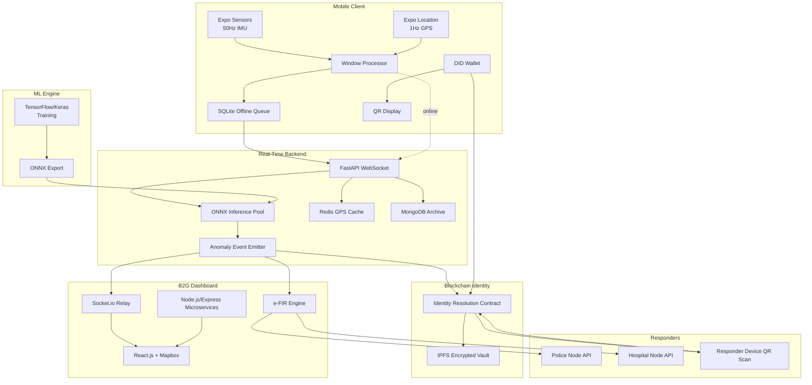

# 02 — System Architecture

> High-level architecture of TourSafe: components, data flow, interfaces, and deployment topology.

---

## 1. Architectural Overview

TourSafe is composed of five primary subsystems:

1. **Mobile Client** — sensor collection, offline buffer, identity wallet, user interface.
2. **Real-Time Backend** — telemetry ingestion, inference, state caching, incident emission.
3. **Machine Learning Engine** — LSTM Autoencoder training and ONNX inference.
4. **Blockchain Identity Layer** — Polygon DID, IPFS vault, emergency access.
5. **B2G Authority Dashboard** — live map, incident feed, e-FIR, responder interface.

A sixth subsystem, the **Hardware Prototype**, validates the sensor→AI pipeline physically.

---

## 2. Component Diagram



---

## 3. Layered Architecture

### 3.1 Edge Layer (Mobile + IoT)
- Captures raw sensor data.
- Pre-processes into A_mag windows.
- Encrypts and queues offline data.
- Stores DID private key in secure enclave.

### 3.2 Ingestion Layer (FastAPI)
- Maintains persistent WebSocket connections.
- Writes live GPS to Redis.
- Archives telemetry windows to MongoDB.
- Routes windows to ONNX inference workers.

### 3.3 Intelligence Layer (ML)
- LSTM Autoencoder evaluates normality.
- Computes reconstruction error.
- Flags anomalies for confirmation.
- (Stretch) SNN-CAD evaluates trajectory hazards.

### 3.4 Identity Layer (Blockchain)
- Anchors DID and public key on Polygon.
- Stores encrypted medical vault on IPFS.
- Grants time-limited emergency decryption rights.
- Maintains immutable audit trail.

### 3.5 Command Layer (Dashboard + e-FIR)
- Visualizes live state and incidents.
- Receives Socket.io push events.
- Generates and dispatches e-FIRs.
- Displays decrypted responder data.

---

## 4. Data Flows

### 4.1 Normal Telemetry Flow
```
Sensor → A_mag → Window → WebSocket → FastAPI → Redis (GPS) + MongoDB (archive)
                                         ↓
                                      ONNX (eval)
                                         ↓
                                      Normal → no action
```

### 4.2 Anomaly / Emergency Flow
```
Sensor → A_mag → Window → WebSocket → FastAPI → ONNX
                                         ↓
                              Reconstruction error > threshold (twice)
                                         ↓
                              Confirmed anomaly
                                         ↓
                    ┌────────────────────┼────────────────────┐
                    ↓                    ↓                    ↓
              Socket.io push      grantEmergencyAccess    e-FIR generation
                    ↓                    ↓                    ↓
              Dashboard alert     Agency key authorized   Haversine routing
                    ↓                    ↓                    ↓
              Operator view       Decrypt IPFS vault      Dispatch to police/hospital
```

### 4.3 Responder Identity Flow
```
Responder scans QR
      ↓
DID extracted
      ↓
resolveDID() on Polygon
      ↓
Fetch encrypted vault from IPFS
      ↓
Decrypt with Emergency Cryptographic Access Key
      ↓
Display medical profile
```

---

## 5. Interface Boundaries

| Interface | Protocol | Data |
|-----------|----------|------|
| Mobile ↔ FastAPI | WebSocket (JSON) | Telemetry windows, config, alerts |
| FastAPI ↔ Redis | Redis protocol | Latest GPS per traveler |
| FastAPI ↔ MongoDB | MongoDB Wire | Profiles, telemetry, incidents, e-FIRs |
| FastAPI ↔ ONNX | In-process | NumPy windows → reconstruction error |
| FastAPI ↔ Dashboard | Socket.io (via Node relay) | Incident packets |
| Mobile ↔ Blockchain | JSON-RPC / ethers.js | DID registration, signing |
| Mobile ↔ IPFS | HTTP API | Encrypted vault upload |
| Dashboard ↔ Blockchain | JSON-RPC / ethers.js | DID resolution, access grants |
| Dashboard ↔ IPFS | HTTP API | Encrypted vault fetch |
| e-FIR Service ↔ Police/Hospital | HTTPS REST | JSON + PDF e-FIR payloads |

---

## 6. Deployment Topology

### Development
- Docker Compose on local machine.
- FastAPI, MongoDB, Redis, Node dashboard, Hardhat local node.

### Staging
- Managed Kubernetes (EKS/GKE/AKS).
- Polygon Amoy Testnet.
- Pinata IPFS.

### Production
- Kubernetes with horizontal pod autoscaling.
- Polygon PoS Mainnet.
- Multi-region MongoDB Atlas for data residency.
- CDN for dashboard static build.
- Managed Redis (ElastiCache / Memorystore).

---

## 7. Scalability Considerations

- WebSocket connections scale horizontally with sticky sessions or shared pub/sub.
- ONNX inference workers are isolated to avoid blocking the event loop.
- Redis shards by traveler_id prefix if needed.
- MongoDB archives are time-series friendly; use TTL for raw telemetry.
- e-FIR microservice scales independently.

---

## 8. Fault Tolerance

- Mobile offline buffer ensures telemetry survival during network loss.
- Redis TTL prevents stale GPS accumulation.
- MongoDB replica sets provide persistence redundancy.
- Dashboard subscribes to Socket.io; reconnects automatically.
- Smart-contract access grants expire automatically.

---

## 9. Security Zones

| Zone | Trust Level | Controls |
|------|-------------|----------|
| Mobile device | High | Secure enclave, encrypted queue, TLS |
| FastAPI backend | High | Private network, mTLS to DBs, secrets manager |
| Dashboard | Medium | JWT + agency RBAC |
| Blockchain | Public | Smart contract access control |
| IPFS | Public | Content is encrypted; CID is public |
| Police/Hospital APIs | Partner | Mutual TLS + API keys |
